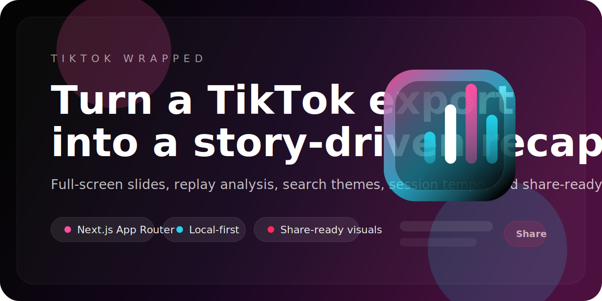

<p align="center">
  
</p>

<p align="center">
  <a href="https://nextjs.org">
    
  </a>
  <a href="https://www.typescriptlang.org">
    
  </a>
  <a href="https://tailwindcss.com">
    
  </a>
  
  
</p>

<h1 align="center">TikTok Wrapped</h1>

<p align="center">
  A full-screen, Spotify Wrapped-inspired web app that turns a TikTok export into a polished behavior report with replay analysis, search themes, session tempo, and share-ready visuals.
</p>

<p align="center">
  <a href="#features">Features</a> ·
  <a href="#quickstart">Quickstart</a> ·
  <a href="#environment">Environment</a> ·
  <a href="#seo--social">SEO</a> ·
  <a href="./docs/DEPLOYMENT.md">Deployment</a> ·
  <a href="./docs/GITHUB.md">GitHub Polish</a> ·
  <a href="./docs/PRIVACY.md">Privacy</a>
</p>

## Features

- Upload `user_data_tiktok.json` directly in the browser
- Full-screen slide deck with scroll-snap transitions
- Watch history, likes, shares, comments, favorites, and search analysis
- Most replayed videos with public TikTok preview thumbnails when available
- Generated "TikTok vibe" summary
- Native share sheet support and copy-link fallback
- Open Graph image, app icon, Apple touch icon, sitemap, robots, and manifest support
- Configurable footer credits for your own name, link, and handle

## Why This Repo Stands Out

- Strong visual identity with an original neon brand mark
- Local-first data processing with no database dependency
- Built for Vercel and standard Next.js hosting
- Clean App Router structure with reusable components
- Search-engine metadata and GitHub-facing repo assets already included

## Supported TikTok Export Data

The current parser handles common TikTok export sections such as:

- `Your Activity > Watch History`
- `Your Activity > Like List`
- `Your Activity > Searches`
- `Your Activity > Share History`
- `Your Activity > Favorite Videos / Sounds / Effects`
- `Your Activity > Following / Follower`
- `Comment > Comments`

If a section is missing, the UI falls back gracefully.

## Quickstart

### Prerequisites

- Node.js 20+
- `pnpm`

### Install

```bash
pnpm install
```

### Run

```bash
pnpm dev
```

Open [http://localhost:3000](http://localhost:3000).

### Production Build

```bash
pnpm build
pnpm start
```

## Environment

Copy the example env file:

```bash
cp .env.example .env.local
```

Available variables:

- `NEXT_PUBLIC_SITE_URL` - final public domain used for canonical URLs and metadata
- `NEXT_PUBLIC_SITE_CREDIT_NAME` - footer credit name
- `NEXT_PUBLIC_SITE_CREDIT_URL` - footer credit link
- `NEXT_PUBLIC_SITE_X_HANDLE` - footer handle used in the UI and Twitter metadata
- `GOOGLE_SITE_VERIFICATION` - optional Google Search Console verification token

## SEO & Social

This repo already includes:

- canonical metadata
- Open Graph and Twitter cards
- JSON-LD structured data
- `robots.txt`
- `sitemap.xml`
- `manifest.webmanifest`
- app icon and Apple touch icon

That covers the important base layer for Google indexing and share previews.

## Deployment

Deploy to Vercel or any Next.js-compatible host.

For Vercel:

1. Push this repo to GitHub.
2. Import it into Vercel.
3. Set the environment variables from `.env.example`.
4. Deploy.

More details: `docs/DEPLOYMENT.md`

## GitHub Polish

This repo includes a dedicated GitHub banner asset and a guide for repo presentation:

- `docs/assets/repo-banner.svg`
- `docs/GITHUB.md`

Use that doc to set:

- repository description
- topics
- website URL
- GitHub social preview image

## Project Structure

```text
app/
  api/tiktok-preview/route.ts
  apple-icon.tsx
  icon.tsx
  layout.tsx
  manifest.ts
  opengraph-image.tsx
  page.tsx
  robots.ts
  sitemap.ts
components/
  BrandMark.tsx
  ReplayCard.tsx
  StatCard.tsx
  UploadCard.tsx
  WrappedSection.tsx
docs/
  assets/repo-banner.svg
  DEPLOYMENT.md
  GITHUB.md
  PRIVACY.md
lib/
  site.ts
  tiktok.ts
public/
  brand-mark.svg
```

## Troubleshooting

### Local install got interrupted

```bash
rm -rf node_modules .next
pnpm install
pnpm build
```

### Social previews do not update

- confirm `NEXT_PUBLIC_SITE_URL` is set to your real domain
- redeploy after metadata changes
- remember that social crawlers cache previews aggressively

## Search Keywords

If you want this repo to be easier to discover on GitHub and Google, the strongest search phrases are already reflected in the code and docs:

- TikTok Wrapped
- TikTok analytics app
- TikTok behavior analyzer
- TikTok data export visualizer
- TikTok JSON dashboard
- Next.js TikTok project
- Spotify Wrapped style web app

## Notes

- This project is not affiliated with TikTok or Spotify.
- The repo uses an original brand mark instead of official platform logos.
